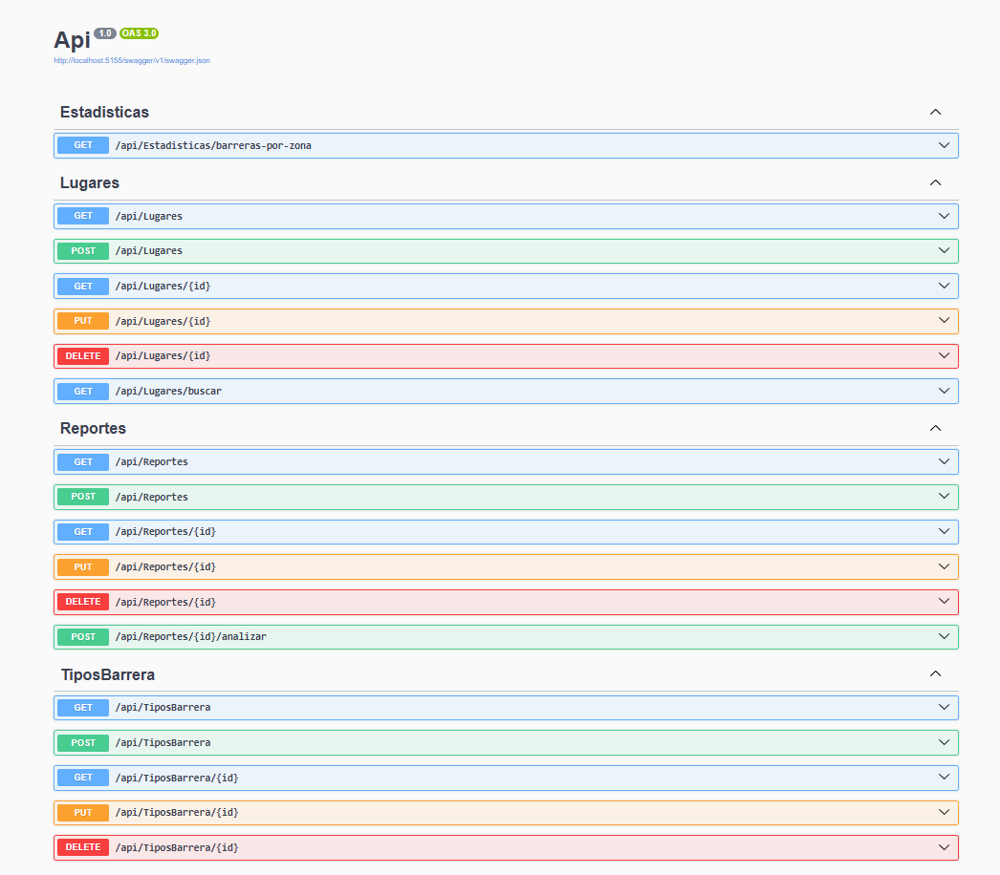

# Ruta Accesible

API REST que recibe reportes ciudadanos de barreras de accesibilidad en espacios públicos de
Barranquilla y los clasifica automáticamente contra los criterios de la norma colombiana
**NTC 6047:2013**, devolviendo el criterio incumplido, una severidad y un ajuste razonable.

**ODS 11**, meta 11.7 (espacios públicos seguros e inclusivos, accesibles para personas con
discapacidad) y **ODS 10**, meta 10.2 (inclusión social de las personas con discapacidad).

> Proyecto final del Diplomado en Programación con .NET.

## El problema

En Colombia **3.134.036 personas, el 7,1% de la población** (Censo DANE 2018), declaran alguna
dificultad para realizar actividades básicas diarias. Casi 1 de cada 14 colombianos.

Una persona con movilidad reducida no tiene forma de saber si un espacio público es transitable
antes de desplazarse. Y cuando reporta una barrera, lo hace en lenguaje natural: "la rampa está
partida y siempre hay motos encima". Nadie conecta ese relato con la norma técnica que se
incumple.

Esta API recibe esa descripción libre, la clasifica contra la taxonomía de la NTC 6047 y
devuelve algo accionable: qué criterio se incumple, con qué severidad y qué adecuación exige la
norma.

## Estado

En desarrollo. Ver `PLANES/README.md` para el avance de cada frente de trabajo.

| Frente | Estado |
|---|---|
| PLAN-00 — Fundación: modelos, `AppDbContext`, migración, Swagger | Completado |
| PLAN-01 — Datos y contratos: DTOs, seed, CRUD de `Lugar`, búsqueda | Completado |
| PLAN-02 — Análisis con IA: servicio de Gemini y endpoint `analizar` | Completado |
| PLAN-03 — Catálogo y consultas: `TipoBarrera` y estadísticas | Completado |
| PLAN-04 — Documentación y QA | Completado |
| PLAN-05 — Cierre y presentación | Bloqueado por PLAN-04 |

## Stack

| | |
|---|---|
| Framework | ASP.NET Core Web API, .NET 8 LTS (`net8.0`) |
| Persistencia | Entity Framework Core con SQLite y migraciones |
| Documentación | Swagger / OpenAPI |
| Modelo de lenguaje | Gemini `gemini-3.6-flash`, vía su endpoint compatible con OpenAI |

## Estructura

```
RutaAccesible.sln
Api/
  Controllers/     un controlador por entidad
  Models/          entidades de EF Core
  Dtos/            Request/Response, separados de las entidades
  Data/            AppDbContext + SeedData
  Services/        servicio del modelo de lenguaje
  Configuracion/   extensiones de inyección de dependencias
  Migrations/      generadas por dotnet ef
docs/
  especificacion.md        diseño acordado: modelo de datos, endpoints, integración con IA
  referencia-ntc6047.md    taxonomía de la norma, cifras y riesgos del modelo
PLANES/            reparto del trabajo por integrante
```

## Cómo ejecutarlo

**Requisitos.** Un SDK de .NET 8 o superior y el **runtime de .NET 8**. No hace falta instalar
el SDK 8 específicamente: el proyecto apunta a `net8.0` y un SDK más nuevo compila para esa
versión sin problema, siempre que el runtime 8 esté presente. Se comprueba con:

```bash
dotnet --list-runtimes    # deben aparecer Microsoft.NETCore.App 8.x y Microsoft.AspNetCore.App 8.x
```

```bash
git clone https://github.com/dony-aep/ruta-accesible-api.git
cd ruta-accesible-api
dotnet tool restore                     # instala dotnet-ef 8.0.29 desde dotnet-tools.json
dotnet restore
dotnet ef database update --project Api # crea ruta-accesible.db y aplica las migraciones
dotnet run --project Api
```

Swagger queda en `/swagger`. Al arrancar, la base se puebla sola con el catálogo de tipos de
barrera de la NTC 6047, once lugares reales de Barranquilla y sus reportes: no hay que cargar
datos a mano para probar los endpoints.

`dotnet tool restore` no es opcional: `dotnet ef` se distribuye como herramienta local fijada en
`dotnet-tools.json` para que los cinco integrantes generen migraciones con la misma versión.

### Configurar la clave del modelo de lenguaje

La clave **no está en el repositorio** y no debe agregarse nunca. Se configura en local:

```bash
dotnet user-secrets init --project Api
dotnet user-secrets set "Ia:ApiKey" "<tu-clave-de-google-ai-studio>" --project Api
```

Se obtiene gratis en [Google AI Studio](https://aistudio.google.com/), sin tarjeta de crédito.
Sin clave, la API funciona igual: el endpoint de análisis responde que el servicio no está
disponible y el resto del CRUD no se ve afectado.

### Por qué Gemini y no Groq

El curso sugiere Groq como proveedor. Este proyecto usa **Gemini `gemini-3.6-flash`** por dos
razones concretas del caso de uso:

1. **Salida JSON forzada.** El endpoint de análisis necesita que el modelo devuelva siempre
   la misma estructura (`codigoCriterio`, `severidad`, `ajusteRazonable`, `certezaIa`) para
   poder deserializarla y guardarla. La llamada usa `response_format: json_object`, que
   obliga al modelo a responder JSON válido en vez de texto con explicaciones alrededor.
   Aun así no se confía en la salida: si no deserializa, o si el criterio propuesto no está
   en el catálogo de la norma, el análisis se descarta y no se guarda nada.
2. **Límites de tokens.** El prompt incluye el catálogo completo de criterios de la NTC 6047
   en cada llamada, para que el modelo elija de una lista cerrada en vez de inventar
   criterios. Ese prompt es largo y el nivel gratuito de Gemini lo admite con holgura.

El cambio no altera el patrón que enseña el curso: se sigue usando `IHttpClientFactory` con un
cliente nombrado y un servicio propio (`Services/ServicioIa.cs`) inyectado por DI, con el
modelo y la clave leídos de configuración. Gemini se consume además por su **endpoint
compatible con OpenAI**
(`https://generativelanguage.googleapis.com/v1beta/openai/`), así que la forma de la petición
es la misma que la del ejemplo con Groq: cambian la URL base y la cabecera de autenticación.
Cambiar de proveedor es reemplazar esos valores en `appsettings.json`.

Se usa deliberadamente un modelo Flash y no Pro: los Pro son de pago desde abril de 2026 y el
proyecto debe poder ejecutarse sin costo.

## Endpoints

18 endpoints repartidos en cuatro controladores, uno por entidad más el de consultas
agregadas. Todos están documentados en Swagger con sus códigos de respuesta.

### Lugares

| Método | Ruta | Descripción | Respuestas |
|---|---|---|---|
| `GET` | `/api/Lugares` | Todos los lugares con sus reportes | 200 |
| `GET` | `/api/Lugares/{id}` | Un lugar por su identificador | 200, 404 |
| `GET` | `/api/Lugares/buscar` | Filtra por `tipo`, `zona`, `soloServicioCiudadano` y `sinBarrerasCriticas` | 200 |
| `POST` | `/api/Lugares` | Registra un lugar | 201, 400 |
| `PUT` | `/api/Lugares/{id}` | Actualiza un lugar | 204, 400, 404 |
| `DELETE` | `/api/Lugares/{id}` | Elimina un lugar y sus reportes | 204, 404 |

### Reportes

| Método | Ruta | Descripción | Respuestas |
|---|---|---|---|
| `GET` | `/api/Reportes` | Todos los reportes | 200 |
| `GET` | `/api/Reportes/{id}` | Un reporte por su identificador | 200, 404 |
| `POST` | `/api/Reportes` | Crea un reporte en estado `Registrado` | 201, 400 |
| `PUT` | `/api/Reportes/{id}` | Avanza el estado del reporte | 204, 400, 404 |
| `DELETE` | `/api/Reportes/{id}` | Elimina un reporte | 204, 404 |
| `POST` | `/api/Reportes/{id}/analizar` | **Clasifica el reporte con el modelo de lenguaje** | 200, 404 |

### Tipos de barrera

| Método | Ruta | Descripción | Respuestas |
|---|---|---|---|
| `GET` | `/api/TiposBarrera` | Catálogo de criterios de la NTC 6047 | 200 |
| `GET` | `/api/TiposBarrera/{id}` | Un criterio por su identificador | 200, 404 |
| `POST` | `/api/TiposBarrera` | Agrega un criterio, con código único | 201, 400 |
| `PUT` | `/api/TiposBarrera/{id}` | Actualiza un criterio | 204, 400, 404 |
| `DELETE` | `/api/TiposBarrera/{id}` | Elimina un criterio sin reportes asociados | 204, 400, 404 |

### Estadísticas

| Método | Ruta | Descripción | Respuestas |
|---|---|---|---|
| `GET` | `/api/Estadisticas/barreras-por-zona` | Conteo de reportes por zona y tipo de barrera | 200 |

El estado de un reporte solo avanza `Registrado -> Analizado -> Verificado -> Atendido`:
retroceder o saltar etapas devuelve 400. Un tipo de barrera con reportes asociados no se
puede borrar, también 400.

## Ejemplos

Respuestas reales de la API con el seed cargado.

### Crear un reporte

`POST /api/Reportes`

```json
{
  "usuario": "ciudadana_prado",
  "descripcion": "El anden de la entrada tiene un escalon alto y no hay rampa, mi papa usa caminador y no puede subir solo.",
  "lugarId": 3
}
```

`201 Created`

```json
{
  "id": 18,
  "usuario": "ciudadana_prado",
  "descripcion": "El anden de la entrada tiene un escalon alto y no hay rampa, mi papa usa caminador y no puede subir solo.",
  "fechaReporte": "2026-08-08T02:08:14.8604608Z",
  "estado": "Registrado",
  "lugarId": 3,
  "nombreLugar": "Parque Cultural del Caribe",
  "zonaLugar": "Centro",
  "tipoBarreraId": null,
  "codigoCriterio": null,
  "nombreCriterio": null,
  "severidad": null,
  "analisisIa": null,
  "ajusteRazonable": null,
  "certezaIa": null
}
```

El reporte nace sin clasificar: los campos de la IA están en `null` hasta que se analiza.

### Analizar el reporte con el modelo de lenguaje

`POST /api/Reportes/18/analizar`

`200 OK`

```json
{
  "reporteId": 18,
  "codigoCriterio": "NTC-RAMPAS",
  "nombreCriterio": "Rampas",
  "severidad": "Alta",
  "analisisIa": "El reporte evidencia un desnivel en la entrada que carece de una solución accesible, impidiendo que una persona con caminador pueda ingresar de manera autónoma. La falta de una alternativa como una rampa condiciona completamente el acceso al espacio. Por lo tanto, se clasifica bajo el criterio de rampas con severidad alta.",
  "ajusteRazonable": "Se sugiere evaluar la construcción e instalación de una rampa de acceso con superficie antideslizante y pendiente suave para superar el desnivel en la entrada.",
  "certezaIa": 0.95,
  "advertencia": "Clasificación sugerida por un modelo de lenguaje. No constituye dictamen normativo y requiere verificación técnica."
}
```

**Si el servicio de IA no responde**, el endpoint no falla: devuelve 200 y el reporte queda
intacto para analizarse más tarde.

```json
{
  "reporteId": 18,
  "analisis": "Servicio de IA no disponible",
  "mensaje": "El reporte quedó registrado y puede analizarse más tarde."
}
```

Se degrada igual si el modelo responde en un formato inesperado o si propone un criterio que
no existe en el catálogo de la NTC 6047, en cuyo caso no se guarda nada.

### Consultar un lugar

`GET /api/Lugares/1`

`200 OK`

```json
{
  "id": 1,
  "nombre": "Centro Administrativo Distrital (Alcaldía)",
  "tipo": "Sede administrativa",
  "zona": "Centro",
  "direccion": "Calle 34 # 43-31",
  "latitud": 10.9814933,
  "longitud": -74.7781999,
  "esServicioAlCiudadano": true,
  "tieneBarrerasCriticas": true,
  "reportes": [
    {
      "id": 1,
      "lugarId": 1,
      "usuario": "ciudadano_anonimo_12",
      "descripcion": "La rampa de la entrada principal está partida por la mitad y casi siempre hay motos parqueadas encima, no se puede subir en silla de ruedas.",
      "estado": "Analizado",
      "tipoBarrera": "Rampas",
      "severidad": "Alta",
      "fechaReporte": "2026-07-21T02:06:52.0454251"
    }
  ]
}
```

### Estadísticas por zona

`GET /api/Estadisticas/barreras-por-zona`

`200 OK`

```json
[
  { "zona": "Centro", "tipoBarrera": "Circulación horizontal", "cantidad": 1 },
  { "zona": "Centro", "tipoBarrera": "Mobiliario y áreas de atención", "cantidad": 1 },
  { "zona": "Centro", "tipoBarrera": "Pasillos y puertas", "cantidad": 1 },
  { "zona": "Centro", "tipoBarrera": "Rampas", "cantidad": 1 },
  { "zona": "Centro", "tipoBarrera": "Señalización", "cantidad": 1 },
  { "zona": "Centro", "tipoBarrera": "Sin clasificar", "cantidad": 4 }
]
```

`Sin clasificar` agrupa los reportes que todavía no han pasado por el endpoint de análisis.

### Errores

Una validación incumplida devuelve `400 Bad Request` con el detalle por campo, en el formato
`ProblemDetails` estándar de ASP.NET Core:

```json
{
  "type": "https://tools.ietf.org/html/rfc9110#section-15.5.1",
  "title": "One or more validation errors occurred.",
  "status": 400,
  "errors": {
    "Tipo": ["El tipo es obligatorio"]
  }
}
```

Un recurso inexistente devuelve `404 Not Found` con el motivo:

```json
{
  "mensaje": "Lugar con ID 999 no encontrado"
}
```

## Capturas

| | |
|---|---|
| Swagger con los 18 endpoints | [`docs/screenshots/01-swagger-ui.png`](docs/screenshots/01-swagger-ui.png) |
| `GET /api/Lugares` con datos del seed | [`docs/screenshots/02-get-lugares.png`](docs/screenshots/02-get-lugares.png) |
| `POST /api/Reportes` creando un reporte | [`docs/screenshots/03-post-reporte.png`](docs/screenshots/03-post-reporte.png) |
| Error 400 de validación | [`docs/screenshots/04-error-400.png`](docs/screenshots/04-error-400.png) |
| Error 404 de recurso inexistente | [`docs/screenshots/05-error-404.png`](docs/screenshots/05-error-404.png) |
| Respuesta del análisis con IA | [`docs/screenshots/06-analisis-ia.png`](docs/screenshots/06-analisis-ia.png) |



La batería completa de pruebas manuales, con el caso válido e inválido de cada endpoint y el
código obtenido, está en [`docs/pruebas.md`](docs/pruebas.md).

## Aviso sobre el uso del modelo de lenguaje

La clasificación que devuelve la API es una **sugerencia generada por un modelo de lenguaje, no
un dictamen normativo**. Requiere verificación técnica. El modelo justifica cada clasificación y
declara un nivel de certeza para que los casos dudosos puedan revisarse.

Las categorías de la NTC 6047 usadas como taxonomía provienen de fuentes secundarias. Las
medidas numéricas de la norma no están verificadas contra el texto original y por eso el
proyecto no las afirma. Detalle en `docs/referencia-ntc6047.md`.

## Equipo

| Integrante | Rol | Plan |
|---|---|---|
| Doney (@dony-aep) | Backend / TL | PLAN-00 |
| Edwin (@Edwin252002) | Docs / QA | PLAN-04 |
| Zamith (@Zamith101) | BD / DTOs (1) | PLAN-01 |
| Gabriela (@gabyd20) | BD / DTOs (2) | PLAN-03 |
| Dilan (@dilansara-jpg) | API / IA | PLAN-02 |

## Cómo contribuir

1. Toma tu plan en `PLANES/`. Dice qué archivos te pertenecen y qué tareas hacer.
2. Rama por plan: `git checkout -b plan-0X-nombre`.
3. **No edites archivos que otro plan declara como propios.** Si necesitas un cambio ahí,
   pídeselo a su dueño.
4. PR contra `main` con la salida real de `dotnet build` pegada en la descripción.
5. Revisión de al menos un compañero antes de mergear.

Español en clases, propiedades, comentarios y mensajes de commit. Sin emojis. Ninguna clave en
el repositorio.
