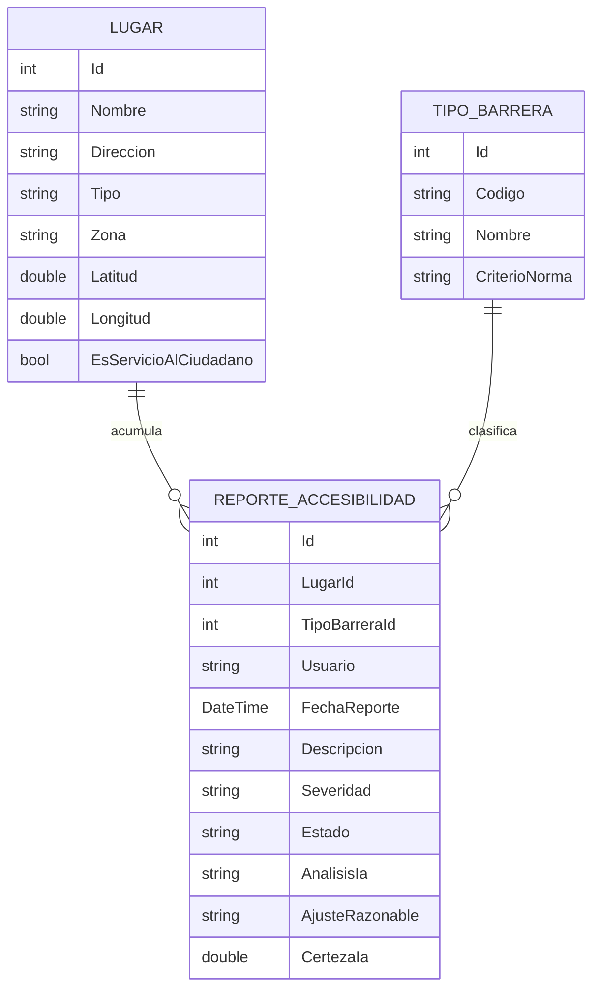
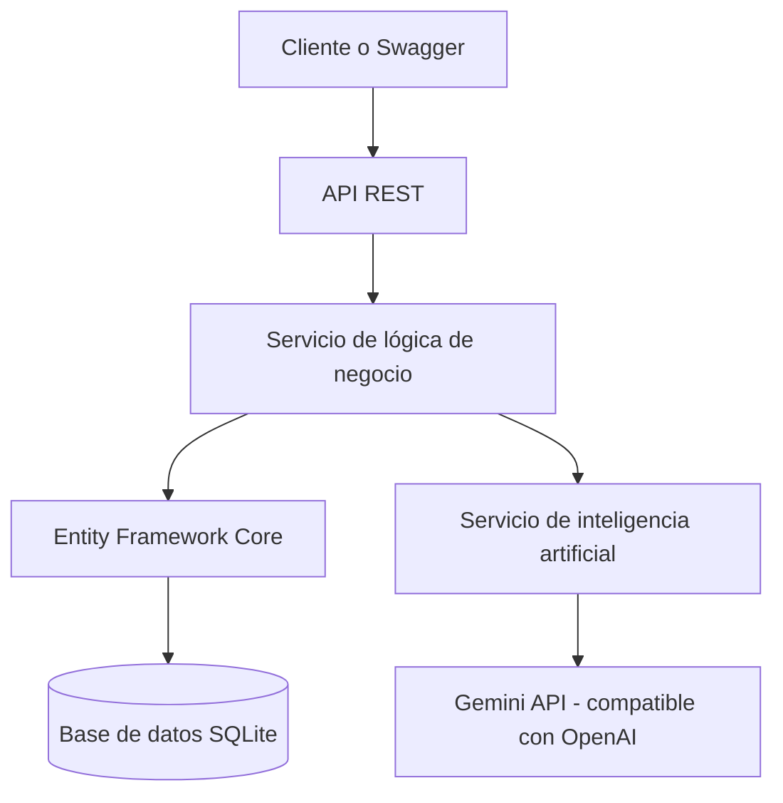

# Ruta Accesible — Definición del Proyecto Final

**Proyecto:** Ruta Accesible
**ODS relacionado:** ODS 11 — meta 11.7, y ODS 10 — meta 10.2

---

## 1. Definición del problema

En Barranquilla, una persona con movilidad reducida no tiene forma de saber si un espacio
público es transitable antes de desplazarse, y cuando reporta una barrera lo hace en lenguaje
natural, sin que nadie conecte ese relato con la norma técnica que se incumple. Se beneficiarían
las 3.134.036 personas con discapacidad en Colombia (7,1% de la población, Censo DANE 2018) y las
entidades obligadas a cumplir la NTC 6047:2013. Una API resuelve esto porque puede recibir la
descripción libre del ciudadano, clasificarla automáticamente contra los criterios normativos y
devolver una severidad y un ajuste razonable accionable, algo que ningún catálogo de categorías
fijas logra. La propuesta responde directamente a la meta 11.7 del ODS 11 (espacios públicos
accesibles) y a la meta 10.2 del ODS 10 (inclusión de personas con discapacidad).

---

## 2. Funcionalidad general de la API

> Nuestra API permitirá **registrar, clasificar y dar seguimiento a reportes ciudadanos de
> barreras de accesibilidad en espacios públicos, conectando cada reporte con el criterio de la
> NTC 6047:2013 que se está incumpliendo**.

Funcionalidades principales:

* Registrar un reporte de barrera de accesibilidad con descripción libre.
* Consultar los reportes registrados y su detalle.
* Actualizar el estado de un reporte (registrado, analizado, verificado, atendido).
* Eliminar un reporte.
* Clasificar automáticamente un reporte mediante IA contra la NTC 6047.
* Administrar el catálogo de espacios públicos (lugares) y sus datos.
* Filtrar lugares por tipo, zona o presencia de barreras críticas.
* Consultar estadísticas de barreras agrupadas por zona y criterio normativo.

| Módulo                          | Funcionalidades                                                                          |
| -------------------------------- | ----------------------------------------------------------------------------------------- |
| Lugares                          | Registrar, consultar, actualizar, eliminar y filtrar espacios públicos                    |
| Reportes                         | Registrar, consultar, actualizar y eliminar reportes; clasificar cada reporte mediante IA |
| Tipos de barrera y estadísticas  | Administrar el catálogo de criterios de la NTC 6047; consultar barreras por zona          |

---

## 3. Recurso principal y modelo de datos

**Recurso principal: `ReporteAccesibilidad`.** Es la entidad de hechos: la crea el ciudadano y la
enriquece la IA. `Lugar` y `TipoBarrera` son catálogos de apoyo sobre los que se apoya el reporte.

### `ReporteAccesibilidad`

| Campo             | Tipo de dato            | Obligatorio | Descripción                                                          |
| ------------------ | ------------------------ | ----------: | --------------------------------------------------------------------- |
| Id                 | int                      |          Sí | Identificador                                                        |
| LugarId            | int (FK)                 |          Sí | Lugar reportado                                                      |
| TipoBarreraId      | int? (FK)                |          No | **Nulo al crear.** Lo asigna el endpoint de análisis, no el ciudadano |
| Usuario            | string                   |          Sí | Seudónimo de quien reporta (nunca datos personales reales)           |
| FechaReporte       | DateTime                 |          Sí | Fecha del reporte (por defecto, la actual)                          |
| Descripcion        | string                   |          Sí | Texto libre. Es lo que alimenta el análisis de IA                    |
| Severidad          | enum? (Baja/Media/Alta)  |          No | La asigna el análisis de IA                                          |
| Estado             | enum                     |          Sí | Registrado, Analizado, Verificado, Atendido                          |
| AnalisisIa         | string?                  |          No | Justificación devuelta por el modelo                                 |
| AjusteRazonable    | string?                  |          No | Adecuación sugerida según la norma                                   |
| CertezaIa          | double? (0–1)            |          No | Nivel de certeza declarado por el modelo                             |

`TipoBarreraId` es nullable a propósito: exigirle al ciudadano que conozca la taxonomía de una
norma técnica trasladaría el problema. El endpoint de análisis es el que la completa.

### Modelos de apoyo

| Modelo        | Campos principales                                                       | Propósito                             |
| -------------- | ---------------------------------------------------------------------------- | ---------------------------------------- |
| `Lugar`        | Nombre, Dirección, Tipo, Zona, Latitud, Longitud, EsServicioAlCiudadano   | Catálogo de espacios públicos          |
| `TipoBarrera`  | Codigo (p. ej. `NTC-RAMPAS`), Nombre, CriterioNorma                        | Catálogo de criterios de la NTC 6047   |

### Relaciones

* `Lugar` 1:N `ReporteAccesibilidad` — un lugar acumula muchos reportes. Al eliminar un lugar se
  eliminan sus reportes en cascada.
* `TipoBarrera` 1:N `ReporteAccesibilidad` — un criterio clasifica muchos reportes. No se puede
  eliminar un criterio que ya está en uso por algún reporte.



---

## 4. Endpoints principales

### Reportes

| Método | Ruta                          | Descripción                                       | Datos de entrada                       | Respuesta esperada                                    |
| ------ | ------------------------------ | ---------------------------------------------------- | ---------------------------------------- | -------------------------------------------------------- |
| GET    | `/api/reportes`                | Listar reportes                                      | —                                        | 200, arreglo de reportes                               |
| GET    | `/api/reportes/{id}`           | Consultar un reporte                                 | —                                        | 200 con el detalle, 404 si no existe                   |
| POST   | `/api/reportes`                | Registrar un reporte con descripción libre           | `lugarId`, `usuario`, `descripcion`      | 201 con el reporte creado, 400 si falla la validación   |
| PUT    | `/api/reportes/{id}`           | Actualizar el estado del reporte                     | Campos a actualizar (p. ej. `estado`)    | 204, 400, 404                                          |
| DELETE | `/api/reportes/{id}`           | Eliminar un reporte                                  | —                                        | 204, 404                                               |
| POST   | `/api/reportes/{id}/analizar`  | **Ejecutar análisis con IA** sobre la descripción     | —                                        | 200 con criterio, severidad, ajuste y certeza; 404      |

### Lugares

| Método | Ruta                                  | Descripción                                                     | Datos de entrada                                                              | Respuesta esperada          |
| ------ | -------------------------------------- | ------------------------------------------------------------------ | -------------------------------------------------------------------------------- | ------------------------------ |
| GET    | `/api/lugares`                        | Listar lugares                                                      | —                                                                                 | 200                            |
| GET    | `/api/lugares/{id}`                   | Detalle de un lugar con sus reportes                                | —                                                                                 | 200, 404                       |
| POST   | `/api/lugares`                        | Crear lugar                                                        | `nombre`, `direccion`, `tipo`, `zona`, `latitud`, `longitud`, `esServicioAlCiudadano` | 201, 400                       |
| PUT    | `/api/lugares/{id}`                   | Actualizar lugar                                                    | Campos a actualizar                                                               | 204, 400, 404                  |
| DELETE | `/api/lugares/{id}`                   | Eliminar lugar                                                      | —                                                                                 | 204, 404                       |
| GET    | `/api/lugares/buscar`                 | Filtro de búsqueda                                                  | Query params opcionales: `tipo`, `zona`, `soloServicioCiudadano`, `sinBarrerasCriticas` | 200                             |

### Tipos de barrera y estadísticas

| Método | Ruta                                  | Descripción                                              | Datos de entrada                    | Respuesta esperada                              |
| ------ | -------------------------------------- | ----------------------------------------------------------- | -------------------------------------- | --------------------------------------------------- |
| GET    | `/api/tiposbarrera`                   | Listar criterios de la norma                                | —                                       | 200                                                 |
| GET    | `/api/tiposbarrera/{id}`              | Detalle del criterio                                        | —                                       | 200, 404                                            |
| POST   | `/api/tiposbarrera`                   | Crear criterio                                              | `codigo`, `nombre`, `criterioNorma`     | 201, 400                                            |
| PUT    | `/api/tiposbarrera/{id}`              | Actualizar criterio                                         | Campos a actualizar                     | 204, 400, 404                                       |
| DELETE | `/api/tiposbarrera/{id}`              | Eliminar criterio                                           | —                                       | 204, 400 si tiene reportes asociados, 404           |
| GET    | `/api/estadisticas/barreras-por-zona` | Conteo de reportes agrupados por zona y criterio             | —                                       | 200                                                 |

---

## 5. Integración con inteligencia artificial

1. **¿Qué información se envía al modelo?** La descripción libre del reporte y la taxonomía
   cerrada de criterios de la NTC 6047 (para que el modelo solo elija entre categorías reales, sin
   inventar nuevas).
2. **¿Qué debe hacer el modelo?** Clasificar el texto contra el criterio normativo que mejor
   corresponde, estimar la severidad de la barrera y redactar un ajuste razonable y una
   justificación breve.
3. **¿Qué respuesta debe devolver?** Criterio de la norma, severidad (Baja/Media/Alta), ajuste
   razonable sugerido, justificación y un nivel de certeza (0–1).
4. **¿Dónde se almacena el resultado?** En los campos `TipoBarreraId`, `Severidad`,
   `AjusteRazonable`, `AnalisisIa` y `CertezaIa` del propio reporte, cambiando además su estado de
   `Registrado` a `Analizado`.
5. **¿Qué ocurre si la IA no responde?** El reporte queda registrado igualmente (no se pierde el
   dato del ciudadano) y la respuesta del endpoint indica que el análisis no está disponible por
   el momento y puede reintentarse más tarde.

**Modelo usado:** Gemini `gemini-3.6-flash`, vía un endpoint compatible con la API de OpenAI. Se
eligió por su cuota gratuita disponible y porque, al ser compatible con OpenAI, permite cambiar
de proveedor cambiando solo una URL y una clave. El riesgo de que el modelo "alucine" un criterio
inexistente se mitiga fijando la taxonomía cerrada de criterios en el prompt y prohibiendo
explícitamente proponer categorías fuera de esa lista.

### Entrada de ejemplo — `POST /api/reportes`

```json
{
  "lugarId": 1,
  "usuario": "ciudadano_anonimo_12",
  "descripcion": "La rampa de la entrada principal está partida por la mitad y casi siempre hay motos parqueadas encima, no se puede subir en silla de ruedas."
}
```

### Respuesta esperada — `POST /api/reportes/{id}/analizar`

```json
{
  "reporteId": 7,
  "criterioNorma": "Rampas",
  "codigoNorma": "NTC-RAMPAS",
  "severidad": "Alta",
  "ajusteRazonable": "Reparar la superficie de la rampa y despejar el acceso mediante señalización y control de parqueo en el área.",
  "justificacion": "La descripción indica deterioro estructural de la rampa y obstrucción permanente del acceso, lo que impide el ingreso autónomo de una persona en silla de ruedas.",
  "certeza": 0.92,
  "advertencia": "Clasificación sugerida por un modelo de lenguaje. No constituye dictamen normativo y requiere verificación técnica."
}
```

### Respuesta cuando el servicio de IA no está disponible

```json
{
  "reporteId": 7,
  "analisis": "Servicio de IA no disponible",
  "mensaje": "El reporte quedó registrado y puede analizarse más tarde."
}
```

---

## 6. Diagrama general del sistema



---

## 7. Distribución inicial de tareas

El equipo está conformado por cinco integrantes. El rol de BD/DTOs se dobla y se reparte por
controlador, un controlador por persona, dando cinco frentes de trabajo en total.

| Integrante | Rol | Plan | Primera tarea asignada |
| --- | --- | --- | --- |
| Doney (@dony-aep) | Backend / TL | PLAN-00 | Crear el repositorio y la estructura inicial |
| Zamith (@Zamith101) | BD / DTOs (1) | PLAN-01 | DTOs, seed, CRUD de `Lugar` y búsqueda |
| Dilan (@dilansara-jpg) | API / IA | PLAN-02 | Servicio de Gemini y endpoint de análisis |
| Gabriela (@gabyd20) | BD / DTOs (2) | PLAN-03 | Catálogo de `TipoBarrera` y estadísticas |
| Edwin (@Edwin252002) | Docs / QA | PLAN-04 | README, capturas y batería de pruebas |

> Los cinco frentes de trabajo previstos son: Backend / TL, BD / DTOs (1), API / IA, BD / DTOs (2)
> y Docs / QA. El detalle de qué construye cada frente está en `../PLANES/README.md`. La
> asignación de cada integrante a su plan se define en la próxima reunión del equipo.

---

## Guion para la presentación (5 minutos)

* **Problema (1 min):** una persona con movilidad reducida no sabe si un espacio es transitable;
  los reportes ciudadanos hoy no se conectan con ninguna norma. 7,1% de la población colombiana
  vive con discapacidad.
* **Recurso principal (1 min):** `ReporteAccesibilidad`, creado por el ciudadano con solo una
  descripción libre; la IA es quien lo clasifica y lo completa.
* **Endpoints (1 min):** CRUD de reportes y lugares, filtro de búsqueda, y el endpoint clave
  `POST /api/reportes/{id}/analizar`.
* **Inteligencia artificial (1,5 min):** el modelo clasifica el texto contra la taxonomía cerrada
  de la NTC 6047 y devuelve criterio, severidad, ajuste razonable y certeza — convertir el relato
  de un ciudadano en una obligación normativa concreta.
* **Reparto de trabajo (0,5 min):** cinco integrantes, una responsabilidad por persona.
